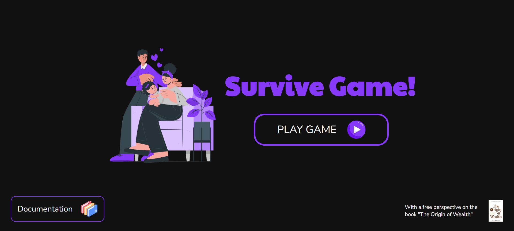
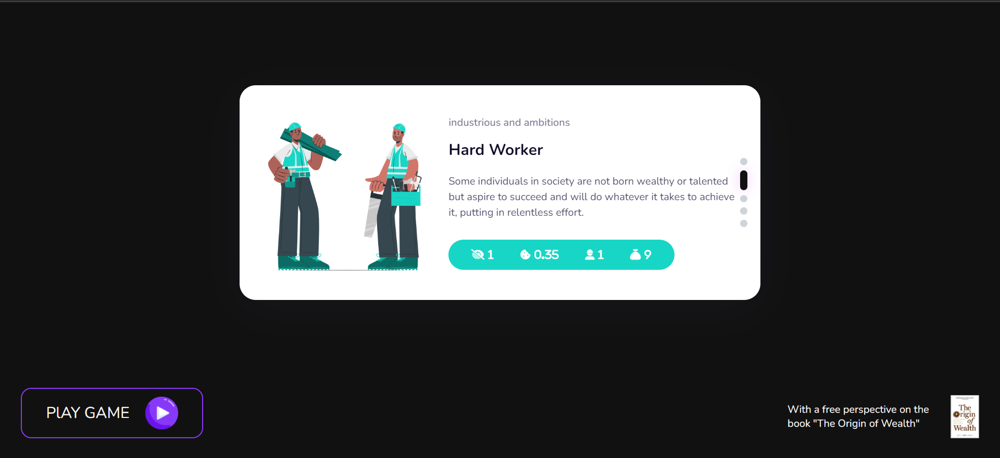
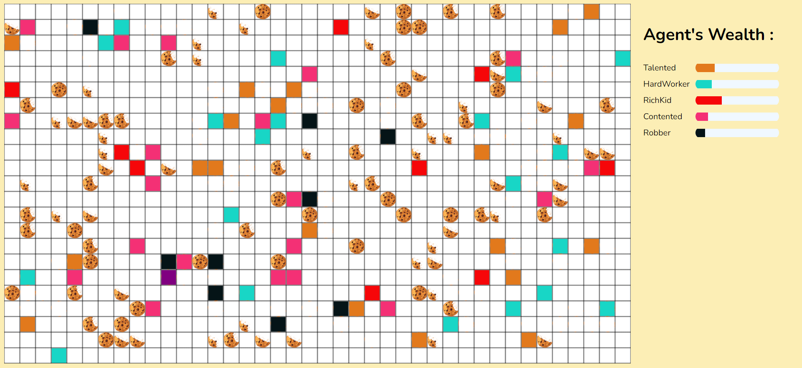

# SurviveGame

# General Overview:

Have you ever wondered why some people are wealthy and others are poor? Is it because the wealthy have oppressed the poor, or is it because the poor are lazy?

# Project Objective:

The objective of this project is to answer a fundamental question about wealth and survival: using a repeating game modeled with game theory.

# Game Analysis:

This game has a game board divided into a chessboard pattern, where a random distribution of cookies is placed. As you know, the resources on Earth are not evenly distributed. On the other hand, we have a set of agents who must search for food with different strategies and personality types in order to survive. These agents are also randomly placed on the game board, and the appearance of an agent with more cookies is completely random, just like in real life, where someone is born in a prosperous country with abundant resources, while another person is born in a less fortunate country.

# Agent Features:

- Vision: How many squares can the agent see and move to?
- Metabolism: How many cookies can the agent consume per second?
- Diligence: How often does the agent search for food?
- Wealth: How much wealth does the agent have at birth?

# Run Project

To execute the project and fully understand the documentation and explanations, open the index.html file.

# Contact Me

- *[Telegram](https://t.me/moeinghasemi)*
- *[LinkedIn](https://linkedin.com/in/moeinmac)*
- *[Email](mailto:moein.mac@gmail.com)*
